# Kinnect Social

This is the Frontend for Kinnect built with React Bootstrap.

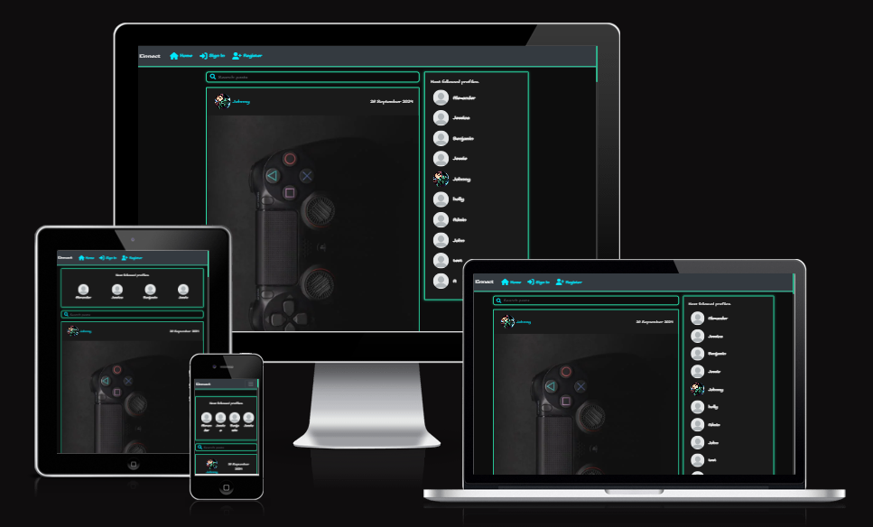

Kinnect is a place where people alike can come together to share their love of gaming. Users can share their experiences, like and write comments, follow other users and rate user profiles. User have full customisation of their profile, have space to write about themselves and what they enjoy and add a profile picture.

This is the Frontend of the application, built in React.

- The deployed version of the API is [HERE](https://kinnect-api-cf0f665319fa.herokuapp.com/).
- The deployed version of the full site built in React is [HERE](https://kinnectsocial-98b2a3f8410d.herokuapp.com/).
- The frontend repository is [HERE](https://github.com/AJMCoder/kinnect_social).

## Wireframes

In the planning stage of this project, I created basic wireframes for desktop and mobile versions of the main pages of the site, outlining the basic structure for the site and where i would like features to be and placement of the core elements of the social site.

[Desktop Wireframe](src/assets/readme/Wireframe-desktop.png)

[Mobile Wireframe](src/assets/readme/wireframe-mobile.png)

## User Stories

Here is a link to the [User Stories](https://github.com/users/AJMCoder/projects/3).

### Admin

**User Stories:**
- As a **site admin** I can **add, edit, and delete profiles from the database** so that **users are safe from spammers or account hackers**
- As a **site admin** I can **remove posts or comments if they are not appropriate or relevant** so that **the site is enjoyable and safe for all users**
- As a **site admin** I can **see lists of all user profiles, posts, likes, and comments, followers** so that **I have an overview of all activity on the site**

### Profile Management

**User Stories:**
- As a **user** I can **sign up for an account** so that I can **make and like posts, and follow other users**
- As a **user** I can **log in and out of my account** so that I can **access the site from different devices and keep my account secure**
- As a **user** I can **add a profile picture and description** so that **I can personalise my profile**
- As a **user** I can **delete my profile** so that **my personal details are not saved if I don't want to use the site anymore**

### Post Management

**User Stories:**
- As a **user** I can **add a new post** so that **I can share my interests or achievements** 
- As a **user** I can **edit my posts** so that **I can make update if i make further progress**
- As a **user** I can **delete my posts** so that **I can remove posts made in error, or that I don't want displayed on my profile anymore**
- As a **user** I can **like and unlike other users' posts** so that **I can engage with content that I enjoy**

### Notifications System

**User Stories:**
- As a **user** I can **see if a user has liked or commented on my posts** so that **I can see how others are interacting with them**

## Features

### Existing Features

- **Navigation Bar**
    - The navigation bar appears across all pages of the application, and changes depending whether the user is logged in or not.
    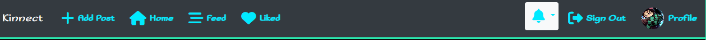

- **Sign In Page**
    - The sign in page allows an existing user to sign in to the site. There is a prompt redirecting the user to the sign up page if they don't already have an account. The layout for the sign in and sign up pages are both the same for visual / stylistic consistency.

        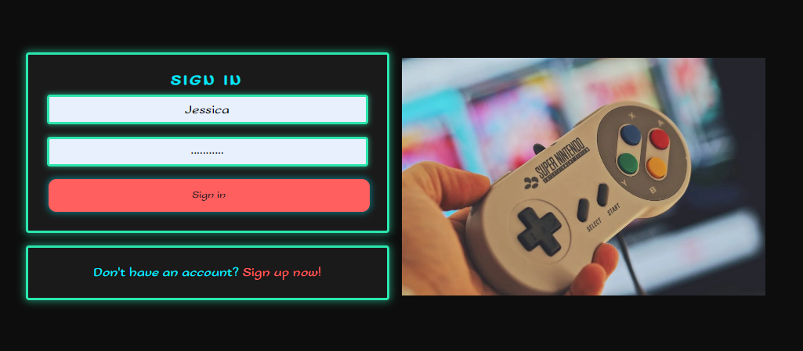

- **Registration Page**
    - The registration page allows a user to create a new account. There is a prompt redirecting the user to the sign in page if they already have an account.
    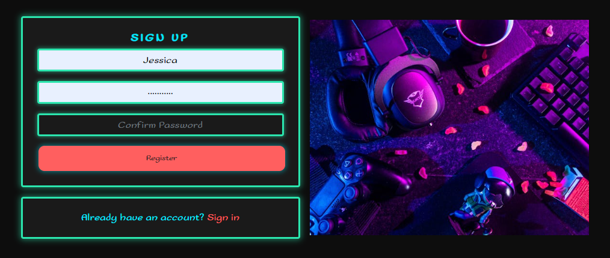

- **Home Page**
    - When the user is logged in, they are directed to the home page, where they can view: Posts from users they follow, users that they can follow, likes and comments, a link to their own profile and the navigation bar across to top.
    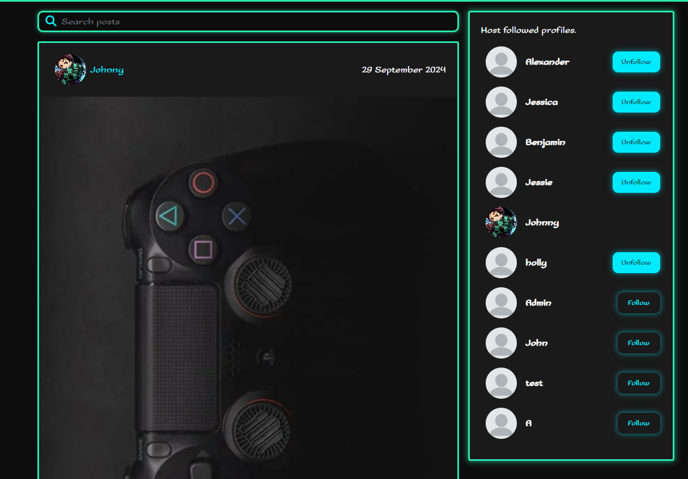

- **Notifications**
    - The notifications feature allows user to actively see who is interacting with their posts. Users will be notified if another user likes, or comments on any post they have made!

        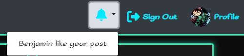

- **Post**
    - A user can post anything gaming related or acheivement related within a game so that user that follow them can view it and interact with it. Users can like or comment on the post.
    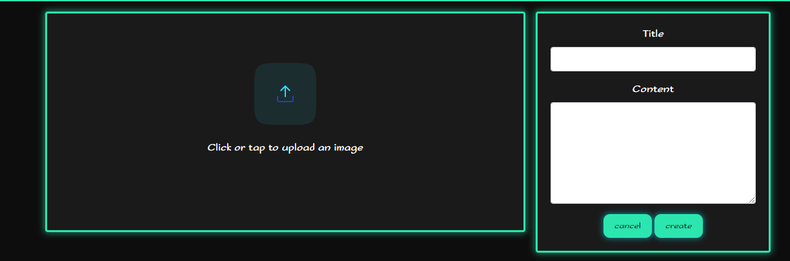

- **Comment**
    - A user can leave a comment on a post. There is a form beneath each post with a free text box. Comments are displayed with the user's profile photo, a link to their profile, and a time stamp showing the date & time the comment was left.
    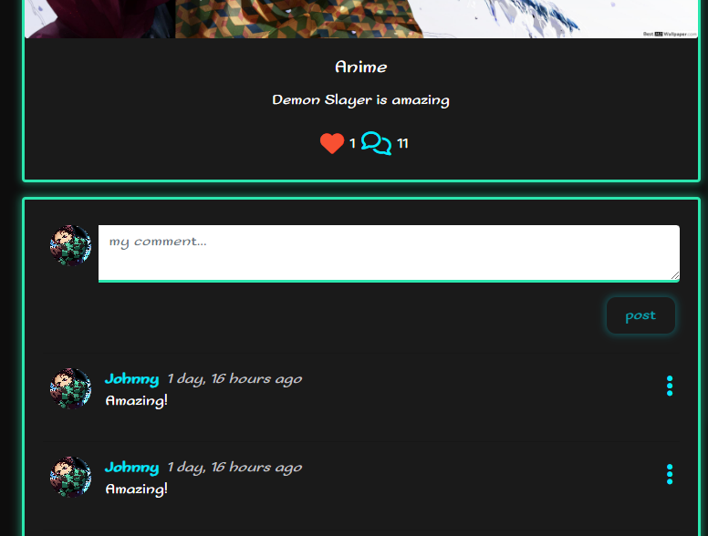

- **Like**
    - Users have the option to like and post that appears in their feed. When a user likes a post, they can see this as the heart icon, symbolising a like, changes colour.
    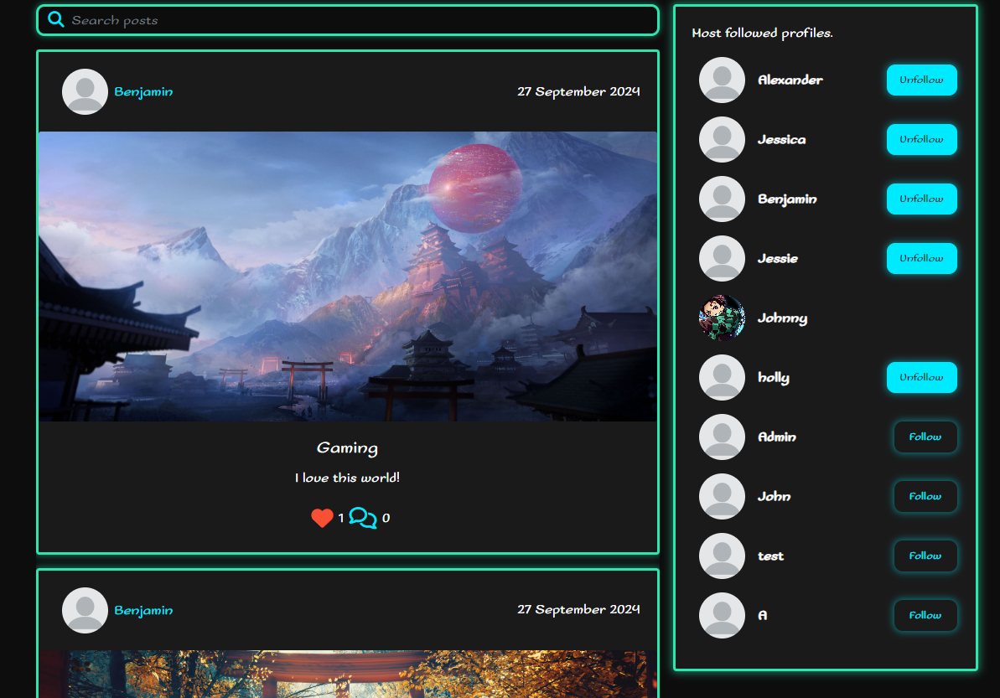

- **Follow**
    - Users have the ability to follow other users so that their feed can contain the posts from said users for them to view.

        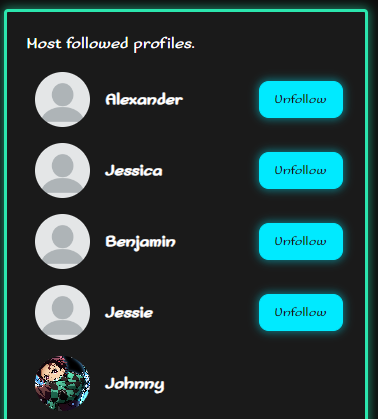

- **Profile Page**
    - The profile page allows a user to view their own or another user's profile. Users can edit their own profile by adding an image and a bio. The page also displays the number posts and rating that a user has, and shows a feed of their posts below their bio.

        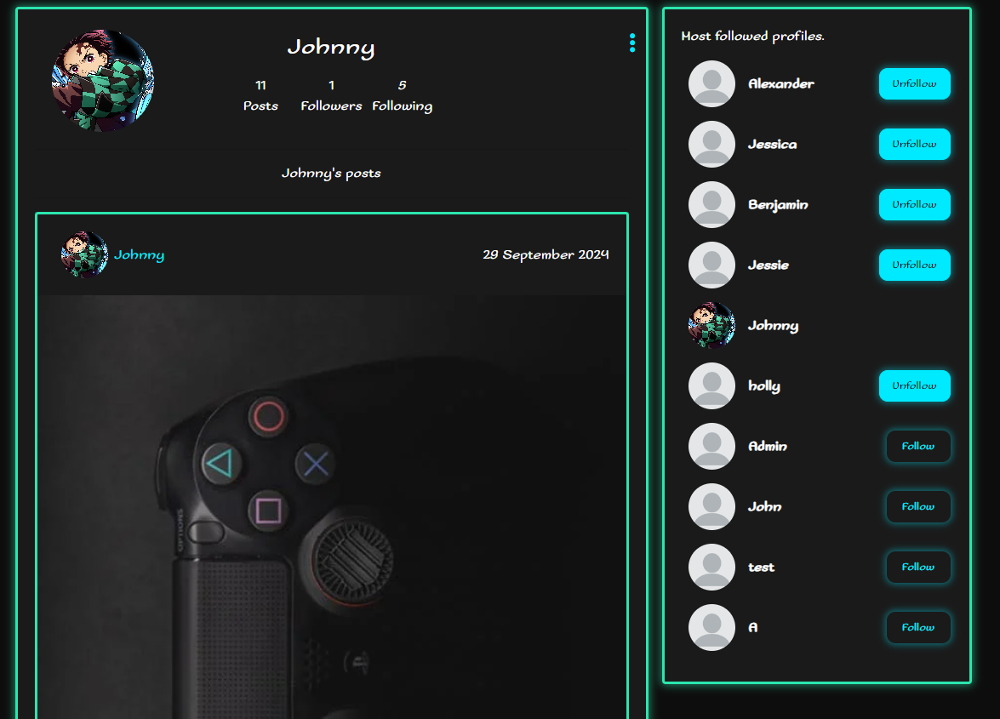

## Future Features

Some features that would benefit the site and its usability would be:

- The ability to publish videos.
- The ability to join small groups maybe for specific gaming communities to join and chat together.
- The ability to have games liked listed in a users profile with images of said games.
- A ratings system, so that users can let other people know how they're liking their posts in a different and interactive way.

## Testing

Please see my [testing file](Testing.md) for all manual, automated and validator testing.

## Bug Fixing:

- When running tests for the Post list, i discovered an error "ERROR: test_can_list_posts (posts.tests.PostListViewTests.test_can_list_posts)". Reading through the error message allowed me to rectify the issue and traceback to the Post.views file where the error persists because the request context was not being passed to the serializer in the PostListView.
- When going back through my work, i was testing the links for 'profiles', and 'posts' before moving forward into 'comments'. I discovered that the '/posts' address was throwing out and operational error for the post.image_filter that had been added. Saving the file and reloading the page, the error persisted. I then realised that it was added after the initial migration of the posts app and so i did 'python manage.py makemigrations' and then 'python manage.py migrate' and reloaded the website and saw that it had fixed the issue.
- I had a major issue where i was receiving constant 500 internal error codes. Having spent hours changing backend configuration, testing autherization, serializers and allowed hosts, it appeared to have been a fault with the cloudinary URL link.
- There was an issue where users were losing their access due to token refreshing. I went into the JWT settings and changed some of the values and set a refresh timer.
- For a while, i was struggling with a console error referencing a POST function of the site, i could work out why a user couldnt add an image to the image field of a post. I was directed to this page on [Stack Overflow](https://stackoverflow.com/questions/44997315/django-rest-framework-got-a-typeerror-when-calling-note-objects-create) by a Tutor, and it helped me randomly, just by simply making me go through the serializer for the posts model.

## Unfixed Bugs

- No current console issues or known bugs.

### Local Deployment

_Gitpod_ IDE was used to write the code for this project.

To preview the project in the development environment, run the following command in the terminal:
`npm start`. This will open port 3000. Click _Open Browser_ when the popup window appears to open the preview in a new window, or _Open Preview_ to open it within the IDE.

To make a local copy of this repository, you can clone the project by typing the follow into your IDE terminal:

- `git clone https://github.com/AJMCoder/kinnect_social.git`

Alternatively, if using Gitpod, you can click below to create your own workspace using this repository.

### Heroku Deployment

This project uses [Heroku](https://www.heroku.com), a platform as a service (PaaS) that enables developers to build, run, and operate applications entirely in the cloud.

- Select _New_ in the top-right corner of your Heroku Dashboard, and select _Create new app_ from the dropdown menu.
- Enter a name for your app. The app name must be unique, so you need to adjust the name until you find a name that hasn't been used.
- From the dropdown, choose the region closest to you (EU or USA), and finally, select _Create App_.
- When the app is created, from the _Deploy_ tab, click on _Github_, enter the name of your GitHub repository, and click _Connect_.
- Optionally, turn on automatic deployments, which will deploy to Heroku every time an update has been pushed to GitHub.
- To deploy to Heroku the first time, click _Deploy_ near the bottom of the page.
- _Note:_ unlike the backend application, there is no need to set any Config Vars for the frontend.

### Preparing the File for Deployment

Before your final deployment, complete the following steps:

- In your `index.js` file, remove the `React.StrictMode` component (be sure to delete both opening and closing tags). This is not necessary outside of production.
- In the `package.json file`, in the “scripts” section, add the following prebuild command:
  `"heroku-prebuild": "npm install -g serve",`. This will install a package needed to serve our single page application on heroku
- Create a file called `Procfile` at the root of the project, and in the file, paste in the following web command:
  `web: serve -s build`.

### Final Deployment

- From Gitpod, run a final `git add .`, `git commit -m` with commit message, and `git push`.
- If automatic deploys are enabled in Heroku, the app is now deployed!
- If not, navigate to the _Deploy_ tab on Heroku. Scroll to the bottom of the page, and click _Deploy Branch_.
- Your app is now deployed.

## Credits

### Content

- [ChatGPT](https://chatgpt.com/) was used to create some of the filler text about the site.
- The [video](https://www.youtube.com/watch?v=i1FeOOhNnwU&list=WL&index=10&t=455s) was used to help with the CSS layout of the website and help refresh my understanding of it.
- Deployment steps are adapted from Code Institute's Moments walkthrough.

### Media

- I used [pexels](https://www.pexels.com/) for all of my images.
- I used [font awesome](https://fontawesome.com/) for the majority of my icons used
- I used [Google fonts](https://fonts.google.com/) for some of the icons required in the project.
- I used [Cloudinary](https://cloudinary.com/) to store and host my images.