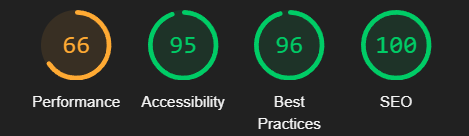

### Manual Testing

- Tested CRUD functionality for all resources:
  - Comments
  - Following/Unfollowing
  - Posts
  - Profiles
  - Likes
  - Notifications

- All nav links are functional. Links either open in a new window (if there is no navigation on the target page), or new pages provide the option to go back.
- Users must be logged in to add Posts, view likes and notifications, and can edit their own Comments, Posts, and Profiles.
- Only an admin / superuser has access to editing and deleting profiles, comments and posts.

I ran some testing through the App.test.js file and created a '__test__' folder within the components folder to house some test for the navbar functionality, signin and sign out functionality and registration. All passed.

The site was tested for responsiveness on the following desktop and mobile devices: Windows PC (Chrome), iPhone 12 Pro Max (Safari).

### Validator Testing

- HTML
  - When passing through the [W3C validator](src/assets/readme/validator/w3c.png) I received only 8 Info Messages on trailing 'slashes'. I have left these in as there is no fundamental effect on the code.
- CSS
  - When passing through the [Jigsaw validator](src/assets/readme/validator/w3c-css.png) I received no warnings in the CSS files.
- JavaScript (ESHint)
  - When passing my code through a [Eslint](src/assets/readme/validator/eshint.png) test I received some errors, mainly to do with props and things missing from its validation. I also received a 'React' must be in scope error in the CurrentUserContent file and the ProfileDataContext file. These do not affect the site functionality so i have left them in for now.

### Lighthouse Testing

- Performance: The poor performance value is generally and mainly due to the image sizing. My thoughts on this for future would be to use Lazyload to take only load images when they are needed rather than all at once. 
- Accessibility: Relatively good score of 88. Some notes from the test: Buttons do not have an accessible name, Link do not have a discernible name.
- Best Practices: Issue noted: Uses third-party cookies.
- SEO: Score of 100.